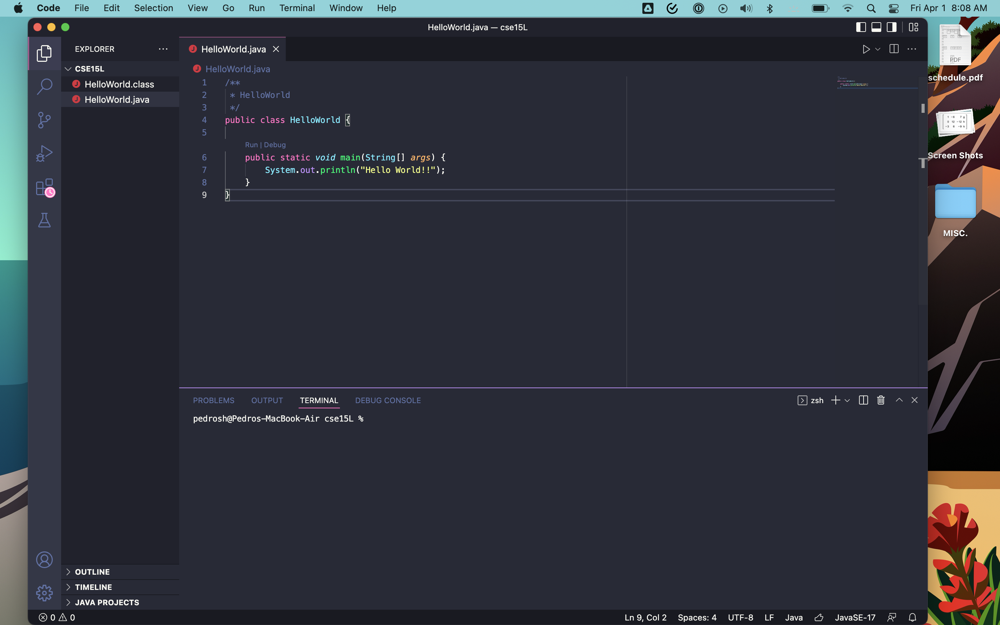
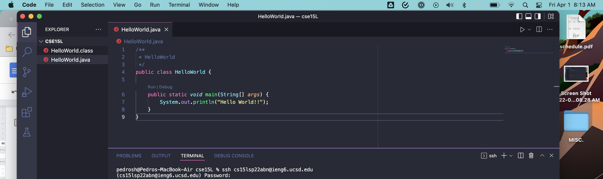
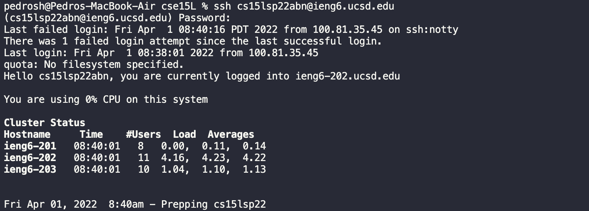
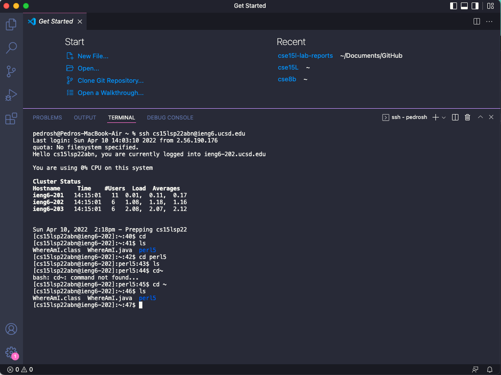
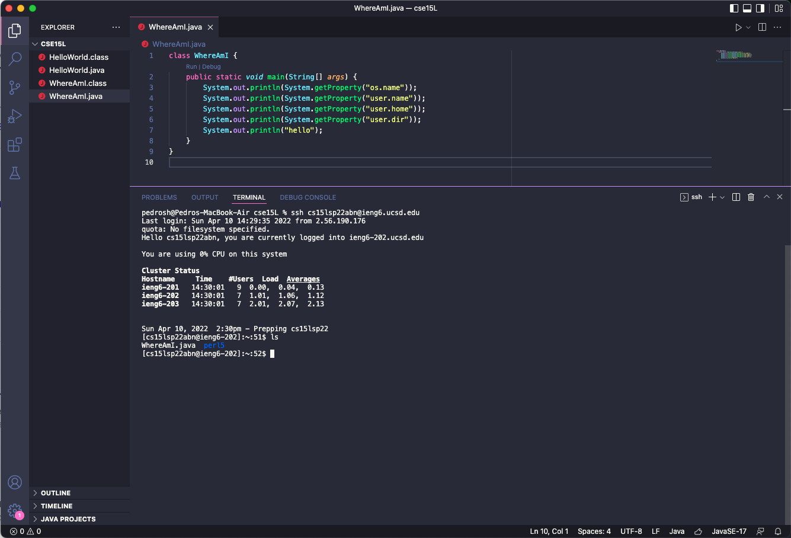
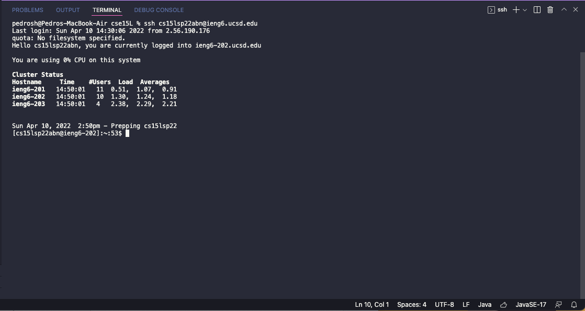
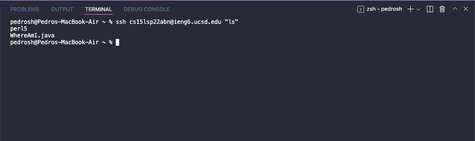

# Lab Report 1: Remote Access Tutorial
Welcome to this tutorial on how to remotely access the computers in the CSE labs.

This tutorial will walk you through from installing VScode on you machine to setting up
**ssh keys** and **optimizing remote running**.

## Instaling VScode
* Visit the Vscode website at [https://code.visualstudio.com][https://code.visualstudio.com] and download the correct version for your machine

* Next follow the instalation steps and open up the application, as well as the terminal using the menu at the top.

* Your window should look like this:



## Remotely Connecting
* The next step is loging into your lab account and connecting to a lab computer remotely.

* In the terminal type/copy the following address: **cs15lsp22xxx@ieng6.ucsd.edu**

> **Note:** this is not going to be your account, the **"xxx"** is just a place holder, your specific account should have different letters there, be sure to use your account

* You will be promted by a password and the screen will look like this:



> **Note:** When typing your account password there will apear to be nothing on the screen being typed. This is a security feature of the remote access, make sure you type it in correctly and hit enter, it should register.

* This is what you will see after a successful login:



## Running some commands
* Next its time to play around with the directory and termianl commands, here are some you can try out:
    * cd --> returns the current directory
    * ls --> lists all items in directory
    * cd perl15 --> travels to the directory **perl15**
    * cd ~ --> backtravels one step (directory)

* Here is what the screen looks like after running all four of these commands:



### Moving files using SCP
* Now onto moving and copying files to the server computer. Using the following code create a file named
**WhereAmI.java** in VScode.

* Paste the following code to the file and once finished compile it using the integrated terminal using **javac WhereAmI.java**.

```
class WhereAmI {
    public static void main(String[] args) {
        System.out.println(System.getProperty("os.name"));
        System.out.println(System.getProperty("user.name"));
        System.out.println(System.getProperty("user.home"));
        System.out.println(System.getProperty("user.dir"));
    }
}
```
* Now back on the VScode terminal type the following command and hit enter:
`scp WhereAmI.java cs15lsp22zz@ieng6.ucsd.edu:~/`

* Now try to log back into the server computer and in the main directory type **ls**, you should see the new file listed there.



## SSH keys
* Logging in can be easier than typing in your password everytime you want to access theserver, lets explore how we can make it quicker.

* Using ssh keys solve that issue by creating a pair of keys (a public and private one). You copy the public key on the server and keep the private one on your machine, the **ssh** command will then pair the two keys together instead of your passowrd and log you in.

* Lets set it up, open the terminal on your machine (not the VScode one) for better results and type in the following command: `$ ssh-keygen`

* Your screen should be showing the following text:

> **IMPORTANT NOTE:** Make sure you do not add a passphrase for this step

```
Generating public/private rsa key pair.
Enter file in which to save the key (/Users/<user-name>/.ssh/id_rsa): /Users/<user-name>/.ssh/id_rsa

Enter passphrase (empty for no passphrase): 
Enter same passphrase again: 

Your identification has been saved in /Users/<user-name>/.ssh/id_rsa.

Your public key has been saved in /Users/<user-name>/.ssh/id_rsa.pub.

The key fingerprint is:
SHA256:jZaZH6fI8E2I1D35hnvGeBePQ4ELOf2Ge+G0XknoXp0 <user-name>@<system>.local

The key's randomart image is:
+---[RSA 3072]----+
|                 |
|       . . + .   |
|      . . B o .  |
|     . . B * +.. |
|      o S = *.B. |
|       = = O.*.*+|
|        + * *.BE+|
|           +.+.o |
|             ..  |
+----[SHA256]-----+
```
> **Note:** The keys randomart will look differently for you

* Now that a key was created, the next step is to copy the private key to the server.

* Log back into the server and type the following command: `$ mkdir .ssh`
    * If there is a message that tells you a key has already been created, that is okay, procceed with the next step

* Log out and now back on your personal terminal type the following command:
```
scp /Users/<user-name>/.ssh/id_rsa.pub cs15lsp22xxx@ieng6.ucsd.edu:~/.ssh/authorized_keys
```
> **Note:** Make sure you use your own account for the step and fill in the **user-name** with your machines username.

* Now try to log back into the server and admire the speed it takes, no password should be promted when you do this step.


> Image of remote access without password

## Optimizing Remote Running
* We can optimize code running by using quotation marks (**" "**) enclosing commands when logging into the server.

* The command will log into the server, run the code in quotes then exit.

* Here is an example of a command you can run:

`$ ssh cs15lsp22zz@ieng6.ucsd.edu "ls"`

* Here is a image of the result of running this command:



* Multiple commands can be run using semicolons on the same line for more optimization and speed, for example: 

`$ cp WhereAmI.java OtherMain.java; javac OtherMain.java; java WhereAmI `

> **Quick tip:** Using the up arrow on your keyboard will recall the last command you run, keep pressing it and you can cycle through your most recent commands. 


