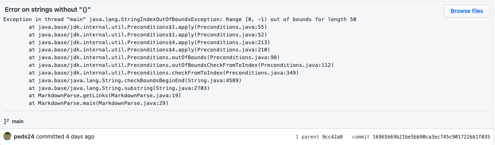
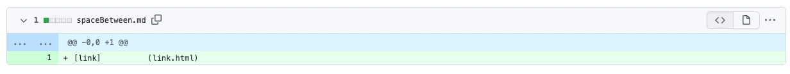
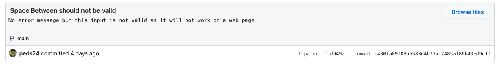

# Lab Report 2: Debugging
## Example 1
### Error on strings without "()"

[Link to the test file that promted the error](https://github.com/peds24/markdown-parser/blob/16965b69b21be5bb90ca3ec745c901722bb1f035/noParenth.md)

### Symptom

### Explanation 
The failure inducing input here is a string that i missing the parenthesis, and our code has a bug therefore due to this input. he code does not know how to handle a situation where a string might have an error or no parentheis. The symptom of this bug is shown by the error when running the code. We get a out of bounds exception, exlpaining that since our code did not know what to do if a parenthesis was missing so it just kept going, showing aan out of bounds error as the while loop continued to run, trying to find where tghe parentheis index is located.

***
## Example 2
### Error on strings without "[]"
![error[]](error2.png)
[Link to the test file that promted the error](https://github.com/peds24/markdown-parser/blob/addeb07649e63d409f806df129581d30738d723f/justParenth.md)

#### Symptom

#### Explanation 
The failure input now is missing the square brackets and a simlar error occures but now the symptom from said bug is a Out of memory error. Because of the input a bug in the code arrises, there is no safety for an input like this, and then a symptom is shown o the user, the eror message when running. Once the bug is addressed, then the symptom goes away because a solution to the input was created, catching errors like this in order to prevent more bugs in the code.

***
## Example 3
### Error on strings with space "in between"

[Link to the test file that promted the error](https://github.com/peds24/markdown-parser/blob/c430fa89f03a6383d4b77ac2485af86b43ed9cff/spaceBetween.md)

#### Symptom

>There is no error in compilation, yet this input is invalid and the code should be able to catch that. What we are texting are links in .md files so the example passed here `[link] (lots of space goes in between) (link.html)` has the incorrect formatting so it would not be a valid link. The code should identify thi serror and not parse it, as its not a valid input.

#### Explanation 
The final bug is tricky and would require more attention onto catching, as a symptom is not immediate. The code manages to run and no error is thrown by the code, yet there it runs in a way it shouldnt. The code will not return the link due to a formatting error. The bug is that the correct output is not being retured. Because of the bad formatting the code should catch this bug and return an erro rmessage explaining the invalid inoput. The symptom here is the expected outcome deffering from the real oyutcome. 

