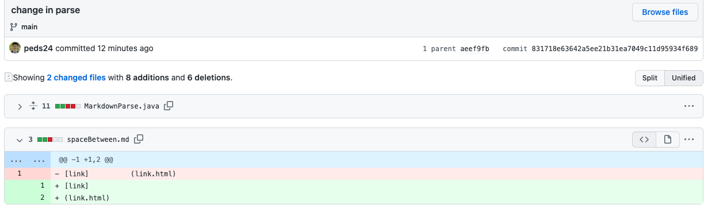

# Lab Report 2: Debugging
## Example 1
### Error on strings without "()"

[Link to the test file that promted the error](https://github.com/peds24/markdown-parser/blob/16965b69b21be5bb90ca3ec745c901722bb1f035/noParenth.md)

### Symptom

### Explanation 
The failure inducing input here is a string that i missing the parenthesis, and our code has a bug therefore due to this input. he code does not know how to handle a situation where a string might have an error or no parentheis. The symptom of this bug is shown by the error when running the code. We get a out of bounds exception, exlpaining that since our code did not know what to do if a parenthesis was missing so it just kept going, showing aan out of bounds error as the while loop continued to run, trying to find where tghe parentheis index is located.

***
## Example 2
### Error on strings without "[]"
![error[]](LabReport2_images/error2.png)
[Link to the test file that promted the error](https://github.com/peds24/markdown-parser/blob/addeb07649e63d409f806df129581d30738d723f/justParenth.md)

#### Symptom

#### Explanation 
The failure input now is missing the square brackets and a simlar error occures but now the symptom from said bug is a Out of memory error. Because of the input a bug in the code arrises, there is no safety for an input like this, and then a symptom is shown o the user, the eror message when running. Once the bug is addressed, then the symptom goes away because a solution to the input was created, catching errors like this in order to prevent more bugs in the code.

***
## Example 3
### Error on strings with space "in between"

[Link to the test file that promted the error](https://github.com/peds24/markdown-parser/blob/c430fa89f03a6383d4b77ac2485af86b43ed9cff/spaceBetween.md)

#### Symptom

#### Explanation 
The input is not breaking the code as a compilation error or run time errror but it is producing an unexpected output. The input has a line in between the second square braket and first parenthesis and the code should see that there is this space and shuld not return the link. The correct output should be an empty list []. The symptom here is the unexpected ouput given by the falirue induciojg input. The bug in the code is the missing if statments that should catch that space as invalid and return an empty list.

