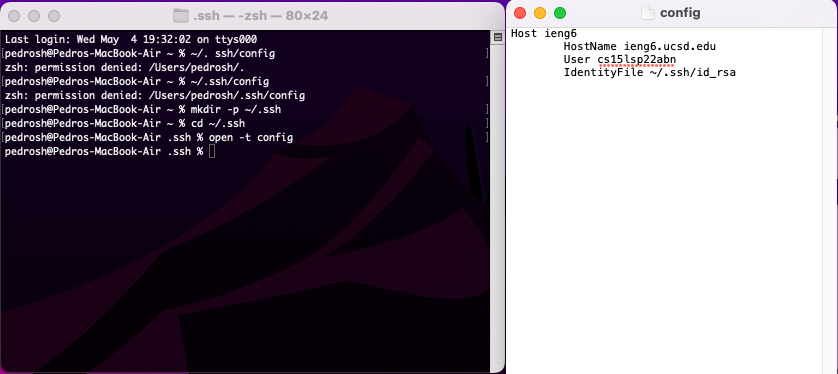
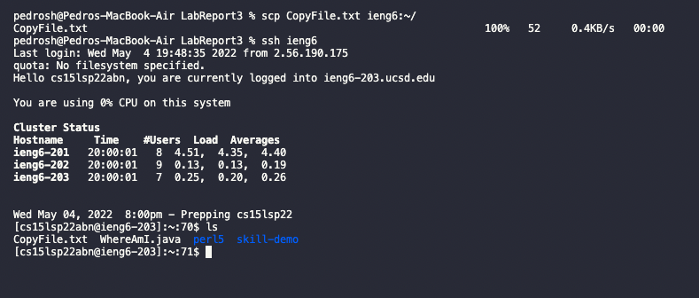
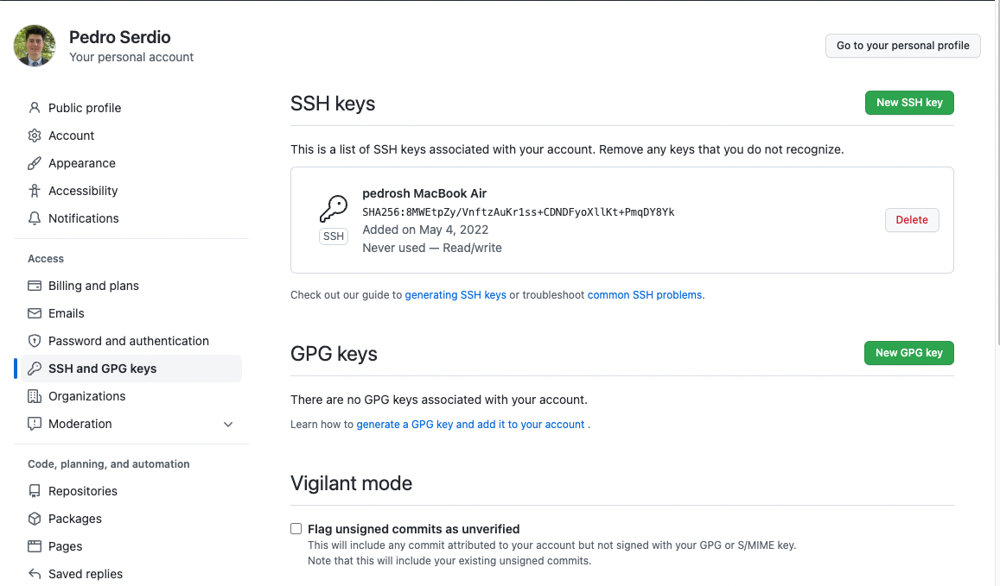
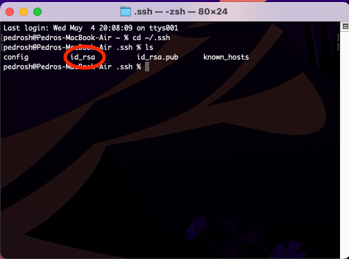

# Lab Report 3
## Streamlining ssh Configuration


**Above is my config file** using the resources linked [here](https://www.techrepublic.com/article/how-to-use-an-ssh-config-file-on-macos-for-easier-connections-to-your-data-center-servers/) I was able to follow the directions to create an .shh config file that would allow for faster access to the ieng6 server. Following the directions * I opend up terminal and created the file using the command:
`nano config`
* Afterwards a editor opend up on my terminal and I copy and Pasted these details below and chnged the data to fit the access for the ieng6 server:
```
Host ieng6
    HostName ieng6.ucsd.edu
    User cs15lsp22zzz (use your username)
    IdentityFile ~/.ssh/id_rsa
```
* Now whenever I want to log into the server, instead of typing out `.ssh cs15lsp22abn@ieng6.ucsd.edu`, I can by-pass that and use the host name I decided, which was ieng6: `ssh ieng6`

* Below is an example of me using the stremalined login to copy a file to the server:



## Setup Github Access from ieng6
* Here is where my public key is stored on the Github page:


* Here is where my private key is located on my computer:



Show running git commands to commit and push a change to Github while logged into your ieng6 account.
Show a link for the resulting commit.


Copy whole directories with scp -r
Show copying your whole markdown-parse directory to your ieng6 account.
Show logging into your ieng6 account after doing this and compiling and running the tests for your repository.
Show (like in the last step of the first lab) combining scp, ;, and ssh to copy the whole directory and run the tests in one line.


