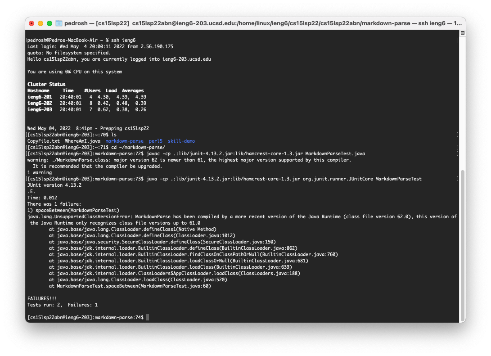

# Lab Report 3
## Streamlining ssh Configuration


**Above is my config file** using the resources linked [here](https://www.techrepublic.com/article/how-to-use-an-ssh-config-file-on-macos-for-easier-connections-to-your-data-center-servers/) I was able to follow the directions to create an .shh config file that would allow for faster access to the ieng6 server. Following the directions * I opend up terminal and created the file using the command:
`nano config`
* Afterwards a editor opend up on my terminal and I copy and Pasted these details below and chnged the data to fit the access for the ieng6 server:
```
Host ieng6
    HostName ieng6.ucsd.edu
    User cs15lsp22zzz (use your username)
    IdentityFile ~/.ssh/id_rsa
```
* Now whenever I want to log into the server, instead of typing out `.ssh cs15lsp22abn@ieng6.ucsd.edu`, I can by-pass that and use the host name I decided, which was ieng6: `ssh ieng6`

* Below is an example of me using the stremalined login to copy a file to the server:


****
## Setup Github Access from ieng6
* Here is where my public key is stored on the Github page:


* Here is where my private key is located on my computer:


* Here is an example of me running git commands to push a commit of a new file created to the main branch:

[link to the commit on GitHub](https://github.com/peds24/cse15l-lab-reports/commit/5895767b457dbeb2abfe013eb8c21df72ae7665d)

****
## Copy whole directories with scp -r
* Using the command scp -r. I managed to copy the markdownparse directory to the server:


* Here is the evidence that the directory was cpied and here is the jUnit test being run on the MarkdownParseTest.java:



* Here is a the command used to copy the directory and run it in the same lines:
`scp -r . ieng6:~/markCopy; javac -cp .:lib/junit-4.13.2.jar:lib/hamcrest-core-1.3.jar MarkdownParseTest.java; ssh ieng6; cd markCopy; java -cp .:lib/junit-4.13.2.jar:lib/hamcrest-core-1.3.jar org.junit.runner.JUnitCore MarkdownParseTest`

* [Link to .txt file that contains the output of the command](LabReport3/Error.txt)
> **Note:** I cannot see the downfall to this command as the output shows that it stops when it logs into the server. the extra command for navigating to the created directory is not run and also the ruinning of the jUnit tests. Any feedback would be helpful.


